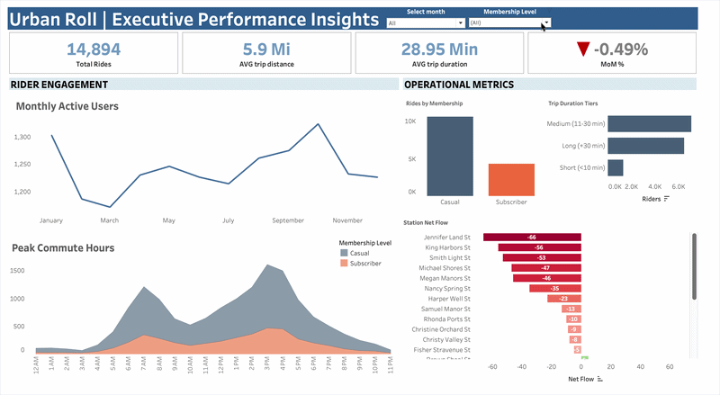
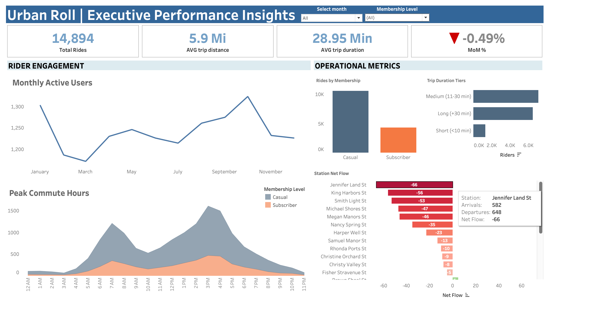

# UrbanRoll: Bike-Share Executive Performance Insights (2024)

## 📌 Executive Summary

UrbanRoll operates a regional bike-sharing network with more than **14,000 recorded rides** throughout 2024. While overall ridership remained relatively stable, leadership identified two growing operational concerns: bikes were frequently unavailable at key stations during commuter hours, and a sharp increase in new customer registrations early in the year did not appear to translate into immediate rider activity.

To investigate these issues, I analyzed trip history and customer registration data using **Google BigQuery** and built an interactive executive dashboard in **Tableau**. The analysis combined rider behavior, station-level network flow, hourly demand patterns, and customer acquisition trends to uncover operational bottlenecks and opportunities for improvement.

Rather than simply reporting performance metrics, this project focuses on using data to support operational decision-making, reduce redistribution costs, improve bike availability, and better connect marketing efforts with customer engagement.

---

## 🧩 Business Context

UrbanRoll's leadership team approached the analysis from two different perspectives.

The **VP of Operations** was focused on increasing operational costs.

> *"We're spending more time moving bikes between stations, but riders are still finding empty docks during busy parts of the day. We need to understand exactly where these imbalances occur."*

Meanwhile, the **VP of Marketing** questioned the effectiveness of customer acquisition.

> *"User registrations have increased significantly this year, but ride activity doesn't seem to be growing at the same pace. Are new users actually becoming active riders?"*

Although the concerns came from different departments, both pointed toward the same business objective: improving the efficiency of the bike-share network.

---

## 🎯 Project Goal

Analyze trip activity and customer registration data to understand rider behavior, identify recurring station imbalances, evaluate customer adoption patterns, and recommend operational improvements that increase bike availability while reducing redistribution effort.

---

## 🔍 Analysis Focus

The project was built around four primary areas of analysis.

### Rider Demand
- Identify when demand is highest throughout the day.
- Determine whether the network primarily serves commuters or recreational riders.
- Understand when operational strain is greatest.

### Customer Behavior
- Compare Subscribers and Casual riders.
- Analyze trip duration patterns.
- Evaluate how each customer segment impacts fleet utilization.

### Station Network Performance
- Measure arrivals and departures at every station.
- Calculate Net Flow to identify stations consistently losing or accumulating bikes.
- Highlight locations requiring operational attention.

### Customer Growth
- Measure month-over-month registration trends.
- Compare account creation with actual ride activity.
- Determine whether marketing growth translated into rider engagement.

---

## 🔗 Interactive Dashboard

View the fully interactive dashboard on Tableau Public:

[Open Dashboard in Tableau Public](https://public.tableau.com)

---

# 📈 Analysis Results

## 🚲 Daily Demand Patterns

**Key Metrics**
- **Total Network Rides:** 14,894
- Peak demand occurs between **7:00–8:00 AM**
- A second sustained demand window occurs between **3:00–5:00 PM**

### Insight
The network functions primarily as a commuter transportation system rather than a recreational service. Ridership follows a predictable weekday commuting pattern that creates recurring pressure on station inventory during morning departures and evening returns.

---

## 👥 Rider Behavior

Two distinct customer groups emerged.

### Subscribers
- Generate the majority of rides
- Take shorter, predictable trips
- Drive consistent weekday demand

### Casual Riders
- Ride less frequently
- Account for most medium and long-duration trips
- Keep bikes unavailable for longer periods

### Insight
Subscribers create predictable ride volume, while Casual riders occupy bikes for significantly longer periods. These differences have important implications for bike availability and fleet planning.

---

## 📍 Station Network Flow

Using station arrivals and departures, I calculated Net Flow for every station.

### Largest Inventory Drain
**Jennifer Land St**
- Net Flow: **-66**
- 648 departures
- 582 arrivals

### Largest Inventory Accumulation
**Brown Shoal St**
- Net Flow: **+5**

### Insight
Bike shortages are not random. Certain stations consistently lose inventory while others repeatedly accumulate bikes, making these locations ideal candidates for proactive redistribution planning.

---

## 📈 Customer Acquisition

Customer registrations experienced rapid growth early in the year.
- **February Signup Growth:** +219%
- Ride activity continued increasing gradually before reaching its highest levels in October.

### Insight
Customer registrations and rider activity are not closely aligned. Many users appear to create accounts months before becoming active riders, suggesting opportunities to improve onboarding and early engagement.

---

# 💡 Recommendations

### Optimize Redistribution Timing
Prioritize fleet redistribution between **10:00 AM and 2:00 PM** to prepare stations before evening commuter demand.

### Encourage Rider-Led Rebalancing
Introduce app-based incentives that reward riders for picking up bikes from depleted stations or ending rides at stations with excess inventory. Leveraging rider behavior can reduce manual redistribution costs.

### Expand Off-Peak Usage
Develop promotions aimed at Casual riders, such as weekend passes or tourism-focused campaigns, to increase utilization outside commuter hours.

### Improve Customer Activation
Launch onboarding campaigns that encourage new users to complete their first ride shortly after registration, reducing the gap between account creation and active usage.

---

# 🚀 Business Impact

This project demonstrates how operational data and customer analytics can be combined to support practical business decisions rather than simply report historical performance.

The Net Flow model identifies stations requiring proactive intervention before shortages occur, while rider segmentation and customer growth analysis explain the underlying behaviors driving those operational challenges. Together, these insights can improve service reliability, lower redistribution costs, and create a better rider experience without expanding infrastructure.

---

## 📘 Key Metrics

- **Total Rides:** Total completed bike trips.
- **Net Flow:** Arrivals minus departures for each station. Negative values indicate inventory loss, while positive values indicate bike accumulation.
- **Source Station:** A station where departures consistently exceed arrivals.
- **Sink Station:** A station where arrivals consistently exceed departures.
- **Month-over-Month (MoM) Growth:** Percentage change compared to the previous month.

---

## 🛠 Tools Used

- **Google BigQuery** — SQL querying, data transformation, window functions, and Net Flow modeling.
- **Tableau Desktop** — Interactive dashboard design and executive reporting.
- **GitHub** — Version control and project documentation.

---

## 📂 Project Files

- [SQL Analysis Pipeline](sql/urbanroll_analysis_pipeline.sql)
- [Tableau Workbook (.twbx)](dashboard/Urbanroll_Excective_dashboard.twbx)
